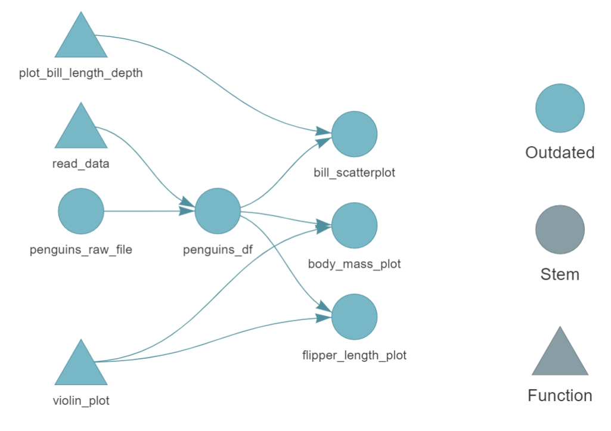
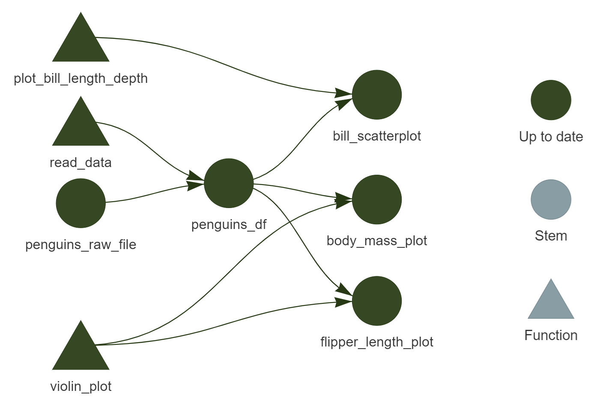
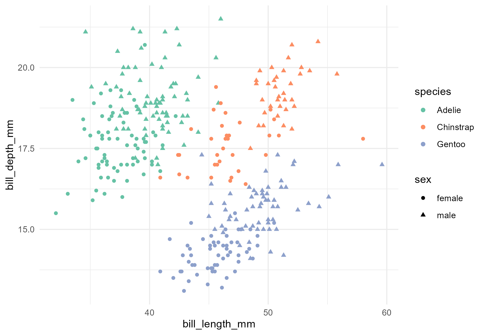
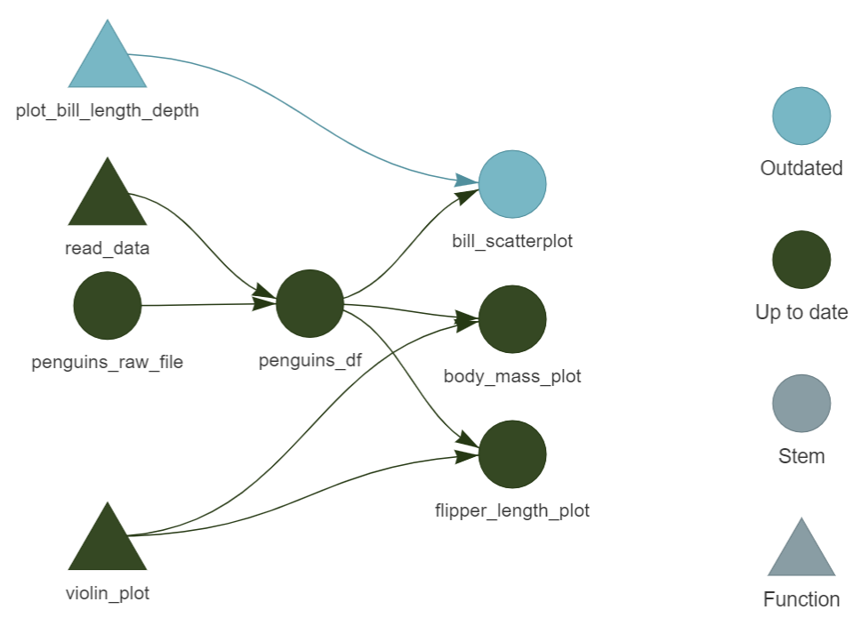
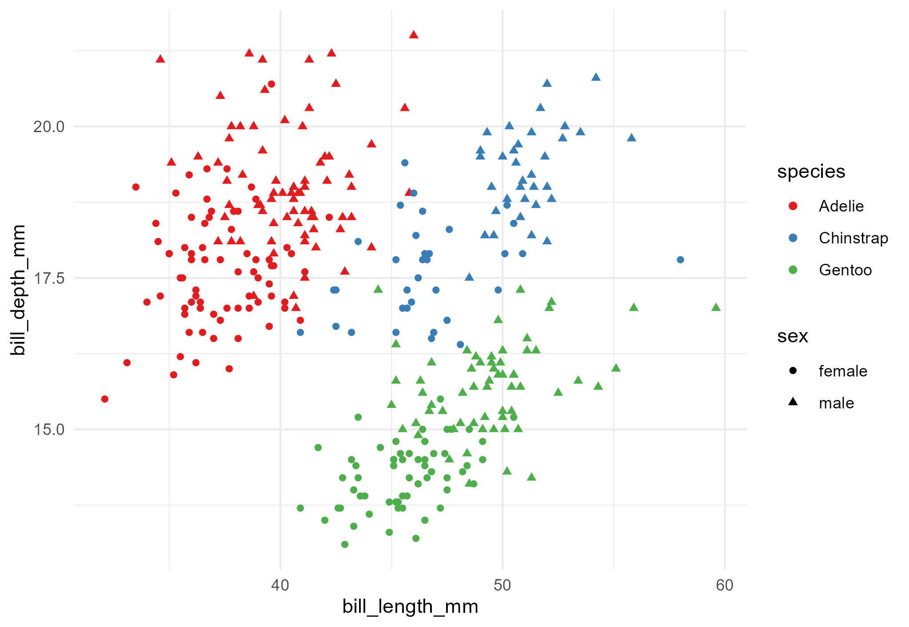
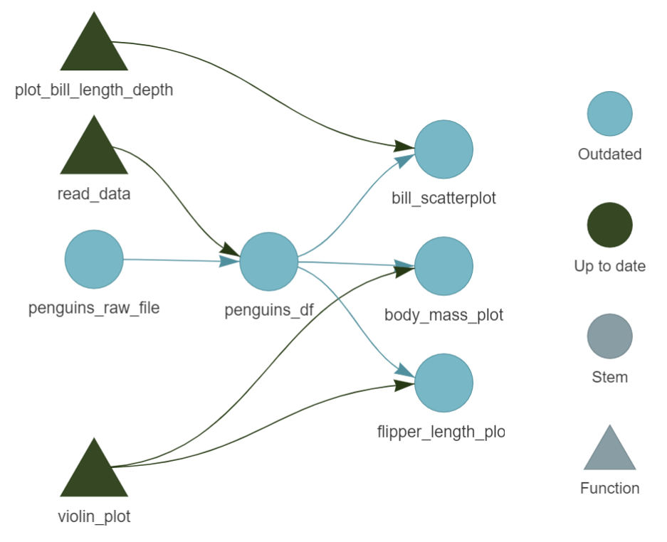
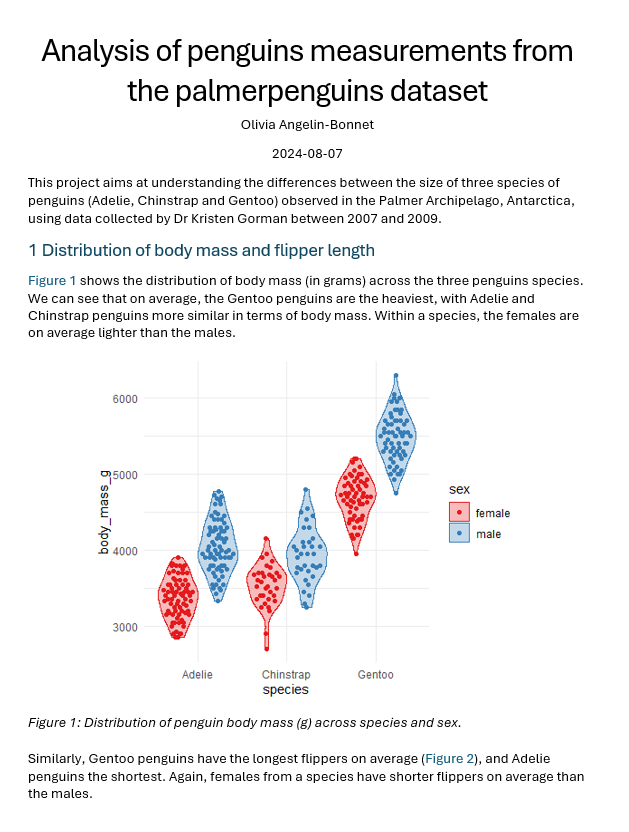
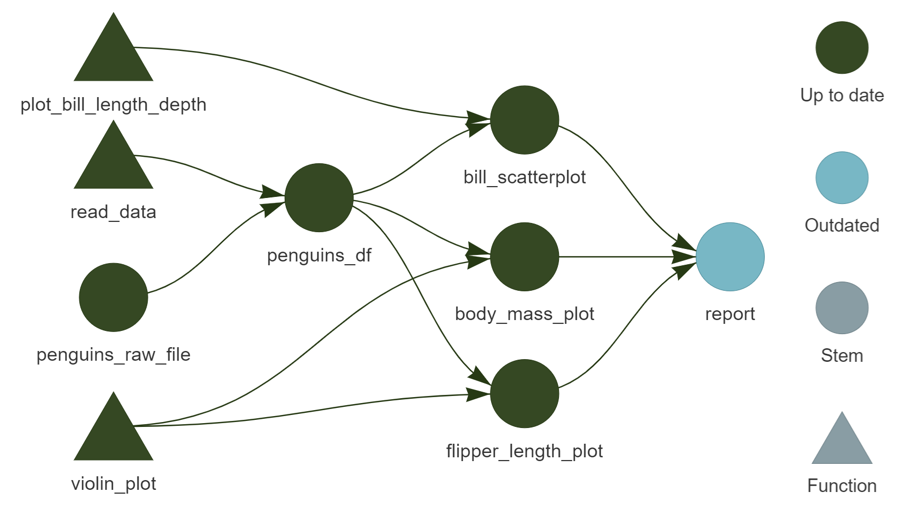

<font size='2'>*Thumbnail image by [shawnanggg](https://unsplash.com/@shawnanggg?utm_content=creditCopyText&utm_medium=referral&utm_source=unsplash) on [Unsplash](https://unsplash.com/photos/yellow-green-and-red-wooden-frame-r2A6WYI8YIg?utm_content=creditCopyText&utm_medium=referral&utm_source=unsplash).*</font>

This is the blog post version of a talk that I gave as part of the [ECSSN and NZSA joint Webinar Series](https://www.statsoc.org.au/event-5815368?CalendarViewType=1&SelectedDate=8/7/2024). The slides are available here.

## Introduction

This presentation is a follow-up to my last seminar on the relevance of software engineering best practices in statistics and data science (you can watch the [recording](https://www.youtube.com/watch?v=e5P-OljGjO0) or see the [slides](https://nzsa-ssa-seminar-2023-slides.netlify.app/#/title-slide)). This first talk gave an overview of these best practices, and I wanted to show how I apply them in my day-to-day job. So in this post, I will walk you through how I set up a typical analysis project in R. Most of the time, the projects that I work on involve:

-   receiving a dataset from the stakeholders

-   cleaning the data

-   performing an exploratory data analysis, usually by constructing some plots

-   fitting a model / running a main analysis

-   generating a report for the stakeholders

In this example, I will work on analysing the [palmerpenguins](https://allisonhorst.github.io/palmerpenguins/) dataset, which can be found in the package of the same name. It consists of a collection of size measurements for three penguin species observed in the Palmer Archipelago in Antarctica.

## Setting up

### Creating a new GitHub repository

The very first thing I do when I start working on the project is to create a GitHub repository that will host all of the code I generate for the project. There are many ways to do this, including:

-   creating a new repository online from [github.com](https://github.com/)

-   creating a new folder locally, then pushing it online

-   using a GitHub GUI such as [GitHub Desktop](https://github.com/apps/desktop)

If you are confused or not sure how to proceed, I recommend going through chapters 14 to 16 of the [Happy Git and GitHub for the useR](https://happygitwithr.com/usage-intro) book.

My preferred method is to first create the repository online. I try to pick an informative name for the repository, add a brief description (if your workplace uses project codes, that is the ideal place to add it), and add a README file. I also like to use the `.gitignore` template for R, although it is not necessary as it will be generated in a following step.

<figure>

<figcaption aria-hidden="true">Creating a new repository on github.com.</figcaption>
</figure>

### Cloning the repository

Once this is done, I need to clone the repository to my machine, to have a local copy on which I can work. Again, there are several ways to do so, and I will only demonstrate one of them. Note that for this step, it is essential to have your git credentials sorted -- I recommend reading the [git credentials vignette](https://usethis.r-lib.org/articles/git-credentials.html) from `{usethis}` or Danielle Navarro's [blog post on git credentials helpers](https://blog.djnavarro.net/posts/2021-08-08_git-credential-helpers/) (which is aimed at Linux users, but is very insightful nevertheless!).

I like to use the `create_from_github()` function from the `{usethis}` package. The advantage is that it does a couple of things automatically:

-   it clones the repository to a directory of my choice (specified through the `destdir` argument)

-   it turns the cloned repository into an Rstudio project (by adding a `.Rproj` file in the root directory)

-   it creates/updates the `.gitignore` file to ignore some files

-   it then opens the newly created project in a separate RStudio session

The command should be run from RStudio (I like to close the current project and run it outside of any project); in my case, it would be:

``` r
usethis::create_from_github(
  "oliviaAB/palmerpenguins_analysis",
  destdir = "C:/Users/hrpoab/Desktop/GitHub/"
)
```

<figure>

<figcaption aria-hidden="true">Cloning a GitHub repository with <code>usethis::create_from_github()</code>.</figcaption>
</figure>

### Initialising `{renv}`

Next, I initialise the `{renv}` package to use in the project. `{renv}` helps to create reproducible environments for R projects by:

-   recording which packages and which version of these packages are used in the project

-   isolating the packages library used in the project from the rest of the computer.

The set-up is extremely simple -- it is simply a matter of running the `init()` function from `{renv}`, which does two things:

-   it creates a `renv.lock` file, which will be where all the packages dependencies of the project will be recorded

-   it creates a `renv/` folder, inside which the packages that are used in the project will be installed. This way, you can install any version of any package that you want, without affecting the other projects on your computer.

The `renv.lock` file will be tracked on GitHub, as it is the recipe that allows others to reproduce the computational environment that I am using for the project. The `renv/` folder on the contrary comes with its own `.gitignore` file, as we don't want our package library to end up on GitHub.

<figure>

<figcaption aria-hidden="true">Setting-up <code>{renv}</code> with <code>renv::init()</code>.</figcaption>
</figure>

The `init()` command should be run once when you set-up the project. After that, there are four commands that you will use. First, when you want to install a package, use `renv::install("tidyverse")`. It will be installed in the project library (i.e. somewhere in the `renv/` folder). Then, before every commit, you can check that the lock file (which records the dependencies of your project) is up-to-date, by running `renv::status()`. This will let you know whether you have added new packages to your scripts (or removed some) since you last recorded your computational environment. If the lock file is not up to date, you can record the changes by running `renv::snapshot()`. Finally, if a collaborator wants to install the packages that you used (with the appropriate version), after cloning your repository, they can run `renv::restore()`, which will use the lock file to guide which packages should be installed.

### Setting up the directory structure

My project directories always follow the same organisation -- this makes it easier for people to understand the layout and to find the necessary information. I use the following set of folders:

-   `data/`: where the data necessary for the project will live (if using a local version of data)[^1]
-   `analysis/`: where I put the analysis scripts
-   `R/`: where I put scripts with helper functions
-   `output/`: where I save generated tables, figures, etc.
-   `reports/`: where I put the files that will be used to generate reports

If you are interested in the topic of how to organise data science projects in R, I recommend you check out [Marwick et al. (2017)](https://doi.org/10.1080/00031305.2017.1375986) "Packaging Data Analytical Work Reproducibly Using R (and Friends)" and the associated `{rrtools}` package.

<figure>

<figcaption aria-hidden="true">Very useful and interesting gif of me creating the folders with RStudio.</figcaption>
</figure>

Once this is done, and I've copied a version of the palmerpenguins dataset in the `data/` folder, here is what my directory looks like:

``` markdown
.
├── .git/
│   └── ...
├── .Rproj.user/
│   └── ...
├── renv/
│   └── ...
├── data/
│   └── penguins_raw.csv
├── analysis/
├── R/
├── reports/
├── output/
├── README.md
├── renv.lock
├── palmerpenguins_analysis.Rproj
├── .Rprofile
└── .gitignore
```

### Populating the README

A key aspect of making our work reproducible is to have sufficient documentation. A part of this is having a good README, which allows users discovering your code in the future to have a good overview of the project. As with the directory structure, I like to follow a consistent format for my README files. In particular, I make sure to record the following information:

-   a brief **description of the project**: context, overall aim, some key information about the experiment and the analyses intended/performed

-   a list of **key contributors** and their roles, as bullet points

-   information about the **input data** (where it is stored), who provided it, what it contains

-   what **analyses** were performed, and which files were generated as a result (e.g. cleaned version of the data)

-   a list of the **key folders and files**

-   which sets of commands to run if you want to **reproduce the analysis**

For example, the README file for this project will look something like:

**README.md**

```` markdown
# Analysis of penguins measurements

This project aims at understanding the differences between the size of three species of
penguins (Adelie, Chinstrap and Gentoo) observed in the Palmer Archipelago, Antarctica.
The data was collected by Dr Kristen Gorman between 2007 and 2009.

## Key contributors

- Jane Doe: project leader

- Kristen Gorman: data collection

- Olivia Angelin-Bonnet: data analysis

## Input data

The raw penguins measurements, stored in the `penguins_raw.csv` file, were downloaded from the 
[`palmerpenguins` package](https://allisonhorst.github.io/palmerpenguins/index.html).

Data source: [...]

## Analysis

- Data cleaning: a cleaned version of the dataset was saved as `penguins_cleaned.csv` on
[OneDrive](path/to/OneDrive/folder).

- *To be filled*

## Repository content

- `renv.lock`: list of packages used in the analysis (and their version)
- `analysis/`: collection of `R` scripts containing the analysis code
- `R/`: collection of `R` scripts containing helper functions used for the analysis
- `reports/`: collection of `Quarto` documents used to generate the reports

## How to reproduce the analysis

```{r}
# Install the necessary packages
renv::restore()
```
````

Note that I didn't fill all of the sections right away; for example the Analysis section will be filled as I add more to my analysis.

### Commit and Push

Now that the set-up is complete, I like to make a first commit, and then push my changes. This ensures that any modifications I make afterwards (typically getting started on the work!) will have its own dedicated commit. I like to use the RStudio interface for that.

<figure>

<figcaption aria-hidden="true">Commit and push changes on GitHub via the RStudio Git panel</figcaption>
</figure>

## After I've started coding

Once the set-up is complete, it is time for the fun stuff: read in the data and start playing with it! I generally start by creating an R script called `first_script.R` (or `temp.R`) in the `analysis/` folder, and programming there. I usually get to the data cleaning stage, and once I have a vague idea of what I need to do for that, I stop and tidy up (what we will do in the next sections). For example, I might get to the point where I have cleaned the data and generated some first EDA plots:

**analysis/first_script.R**

``` r
library(tidyverse)
library(janitor)
library(ggbeeswarm)
library(here)

# Reading and cleaning data
penguins_df <- read_csv(here("data/penguins_raw.csv"), show_col_types = FALSE) |> 
  clean_names() |> 
  mutate(
    species = word(species, 1),
    year = year(date_egg),
    sex = str_to_lower(sex),
    year = as.integer(year),
    body_mass_g = as.integer(body_mass_g),
    across(where(is.character), as.factor)
  ) |> 
  select(
    species,
    island,
    year,
    sex,
    body_mass_g,
    bill_length_mm = culmen_length_mm,
    bill_depth_mm = culmen_depth_mm,
    flipper_length_mm
  ) |> 
  drop_na()

## Violin plot of body mass per species and sex
penguins_df |> 
  ggplot(aes(x = species, colour = sex, fill = sex, y = body_mass_g)) +
  geom_violin(alpha = 0.3, scale = "width") +
  geom_quasirandom(dodge.width = 0.9) +
  scale_colour_brewer(palette = "Set1") +
  scale_fill_brewer(palette = "Set1") +
  theme_minimal()

## Violin plot of flipper length per species and sex
penguins_df |> 
  ggplot(aes(x = species, colour = sex, fill = sex, y = flipper_length_mm)) +
  geom_violin(alpha = 0.3, scale = "width") +
  geom_quasirandom(dodge.width = 0.9) +
  scale_colour_brewer(palette = "Set1") +
  scale_fill_brewer(palette = "Set1") +
  theme_minimal()

## Scatter plot of bill length vs depth, with species and sex
penguins_df |> 
  ggplot(aes(x = bill_length_mm, y = bill_depth_mm, colour = species, shape = sex)) +
  geom_point() +
  scale_colour_brewer(palette = "Set2") +
  theme_minimal()
```

This is a good start, and for small analyses, we could stop there and stick with this one R script. But often, the analyses that I do involve a lot more than generating a few plots, and as a result, this R script would become long and convoluted. This would make it much harder to understand what is happening in the script, and to find specific commands that, say, generate a particular plot. In addition, if I make some changes to a part of my analysis, I don't want to have to re-execute the entire script -- imagine if some of the steps take hours to run, we don't want to do that every time we change the colours in a plot!

This is why I started using the `{targets}` package. Rather than explaining what the package does (which is already done very well in the [`{targets} manual`](https://books.ropensci.org/targets/)), I will show how I use it.

### Turn your code into functions

The first step to converting my plain R script into a `{targets}` pipeline is to create functions. It might sound daunting, but it is really just about bundling parts of the script into neat little packets that handle one step of the analysis. For example, the following chunk from the `analysis/first_script.R` script is responsible for reading in and cleaning the raw data:

<!-- A rule of thumb might be to group all code that generates an intermediate object into one function. -->

``` r
# Reading and cleaning data
penguins_df <- read_csv(here("data/penguins_raw.csv"), show_col_types = FALSE) |> 
  clean_names() |> 
  mutate(
    species = word(species, 1),
    year = year(date_egg),
    sex = str_to_lower(sex),
    year = as.integer(year),
    body_mass_g = as.integer(body_mass_g),
    across(where(is.character), as.factor)
  ) |> 
  select(
    ## all relevant columns
  ) |> 
  drop_na()
```

This can easily be turned into a function, helpfully named `read_data()`, which takes the path to the raw file as input and returns the cleaned data as output:

``` r
read_data <- function(file) {
  readr::read_csv(file, show_col_types = FALSE) |> 
  janitor::clean_names() |> 
  dplyr::mutate(
    species = stringr::word(species, 1),
    year = lubridate::year(date_egg),
    sex = stringr::str_to_lower(sex),
    year = as.integer(year),
    body_mass_g = as.integer(body_mass_g),
    dplyr::across(
      dplyr::where(is.character), 
      as.factor
    )
  ) |> 
  dplyr::select(
    ## all relevant columns
  ) |> 
  tidyr::drop_na()
}
```

The code is the same as in my script, except I replaced the file path by the `file` argument, which will be passed to the function. Another thing that has changed is that I have explicitly specified the package from which each function comes from, using the `package::function()` notation. This is a habit I took when I started writing R packages, but I think it is very useful whenever you start writing your own functions (regardless of whether they will go in a package), as it makes it easier to differentiate your own functions from those imported from another package.

Of course, it is good practice to document the function that we just created. Again, as a habit I developed when writing R packages, I like to use `{roxygen}`'s style comments, which in this case would look like that:

``` r
#' Read and clean data
#' 
#' Reads in the penguins data, renames and selects relevant columns. The
#' following transformations are applied to the data: 
#' * only keep species common name
#' * extract observation year
#' * remove rows with missing values
#' 
#' @param file Character, path to the penguins data .csv file.
#' @returns A tibble.
read_data <- function(file) {
  readr::read_csv(file, show_col_types = FALSE) |> 
  janitor::clean_names() |> 
  dplyr::mutate(
    ## modifying columns
  ) |> 
  dplyr::select(
    ## all relevant columns
  ) |> 
  tidyr::drop_na()
}
```

This can seem like too much work (the function is not that long and we can clearly see what it is doing), but I found that when going back to my own code a few months later, especially if I ended up writing many functions, it is always nice to have a summary of what each function does. In particular, I like to keep track in the description of any information that will be useful when I write the report; for example here I described the steps I took during data cleaning. Of course, writing documentation in this format means that every time I make a change to a function, I need to ensure that the documentation is up-to-date, which is why I like to write and test the function first before writing the documentation.

All my functions are saved in a script called `helper_functions.R` within the `R/` folder. As the analysis grows, and the number of functions with it, I like to split this script into different files, each containing blocks of functions involved in the same step, e.g. `R/data_cleaning.R`, `R/eda.R`, `R/modelling.R` etc. For now, my `helper_functions.R` script looks like this (see the full file [here](https://github.com/oliviaAB/palmerpenguins_analysis/blob/main/R/helper_functions.R)):

**R/helper_functions.R**

``` r
#' Read and clean data
#' 
#' ...
read_data <- function(file) { ... }

#' Violin plot of variable per species and sex
#' 
#' ...
violin_plot <- function(df, yvar) { ... }

#' Scatter plot of bill length vs depth
#' 
#' ...
plot_bill_length_depth <- function(df) { ... }
```

This greatly simplifies the main script, which now looks like this:

**analysis/first_script.R**

``` r
library(here)

source(here("R/helper_functions.R"))

penguins_df <- read_data(here("data/penguins_raw.csv"))

body_mass_plot <- violin_plot(penguins_df, body_mass_g)

flipper_length_plot <- violin_plot(penguins_df, flipper_length_mm)

bill_scatterplot <- plot_bill_length_depth(penguins_df)
```

At the top of the script, I sourced the functions I created. Then, I can simply use them! You can notice that in this new script, I do not load the packages that I use in my functions any more. This is because they are loaded when an expression of the type `package::function()` is executed (or something like that).

### Turn your script into a `{targets}` pipeline

The next step is to transform our main script into a `{targets}` pipeline. To do so, it is helpful to notice the pattern that `main_script.R` follows:

-   read the data with `read_data()`, save it into an object called `penguins_df`

-   use the `violin_plot()` function on the `penguins_df` object to create a plot, which is stored in the `body_mass_plot` object

-   use the `violin_plot()` function on the `penguins_df` object to create a second plot, which is stored in the `flipper_length_plot` object

-   use the `plot_bill_length_depth()` function on the `penguins_df` object to create a plot, which is stored in the `bill_scatterplot` object

Basically, my analysis can be split into a series of *steps*, where each step applies a *function* and saves the result into an *object*. The steps are interlinked, as the output of one step might be the input of another step.

A `{targets}` pipeline is simply a list that describes a series of steps, where each step is created with the `targets::tar_target()` function, which takes two arguments:

-   the name of the target (basically, what you want to call the object that results from this step)

-   the expression that needs to be evaluated for this step (i.e. the function call used in this step)

The name of a target is used as any other R object in a function call. For the purpose of this example, there is a special type of target (or step), which gives the path for input data files, and we will see exactly what they do in a later section.

So, the main script can be transformed into the following `{targets}` script:

``` r
library(targets)
library(here)

source(here("R/helper_functions.R"))

list(
  tar_target(penguins_raw_file, here("data/penguins_raw.csv"), format = "file"),
  
  tar_target(penguins_df, read_data(penguins_raw_file)),

  tar_target(body_mass_plot, violin_plot(penguins_df, body_mass_g)),

  tar_target(flipper_length_plot, violin_plot(penguins_df, flipper_length_mm)),

  tar_target(bill_scatterplot, plot_bill_length_depth(penguins_df))
)
```

We start by loading the `{targets}` and `{here}` packages, and sourcing the helper functions. Then we create a big list where each element is created via the `tar_target()` function. In each case, the first argument is the target name, and it is followed by the code to execute for this step. In the case of the raw data file path, there is a third argument: `format = "file"`. This tells `{targets}` that the character returned is a file path, and should be treated in a special way (more on that soon!). The name of the targets are used to pass the results of the target to a function for the next target.

By default, the `{targets}` package expects this targets script to live in a file called `_targets.R` in the root directory of your Rstudio project. This is perfectly fine, but I like to have my analysis scripts tucked in the `analysis/` folder instead. You could also want to call it something else. In both cases, we need to specify it in a `{targets}` configuration file. This might sound complicated, but in fact it's only a matter of running the following command line in R:

``` r
targets::tar_config_set(script = "analysis/_targets.R", store = "analysis/_targets")
```

Basically, the `script` argument takes the path to the R script that contains your pipeline; the `store` argument takes the path to the folder in which `{targets}` will store the results of the pipeline. As a rule of thumb, it should live alongside the targets script, and be called with the same name (except that it's a folder an not an R script).

This will create a file called `_targets.yaml` with the following content:

**\_target.yaml**

``` txt
main:
  script: analysis/_targets.R
  store: analysis/_targets
```

Careful, this file will be created where the `tar_config_set()` function is run, so make sure that you are in the root directory when running the command.

### Visualise your pipeline

As we've seen, the series of targets that we created are linked to each other by their input and output. We can visualise these links by representing the entire analysis pipeline as a directed acyclic graph (or DAG), in which each target is a node, and edges go from target A to target B if the output of target A is used as input for target B. We can do so with the `tar_visnetwork()` function, which returns an interactive graph:

``` r
targets::tar_visnetwork()
```



In the DAG, they are two types of nodes: the round ones correspond to the targets, while the triangle ones show the functions that are used in each targets (only functions that are sourced will be shown).[^2] As expected, `penguins_raw_file`, which contains the path to the data file, is used to create `penguins_df`, which is in turn passed to the different plotting functions to generate three plots. For now, all nodes are blue, which means that they are "outdated": `{targets}` does not have an up-to-date value for these targets. This means that we need to run the pipeline.

Note that contrary to a regular R script, the different targets will not be executed in the order in which they are written in the list; instead, `{targets}` analyses the links between the different targets to figure out the order in which they should be run.

### Execute your pipeline

In order to execute the code specified in the targets pipeline, we need to run:

``` r
targets::tar_make()
```

The function reads our targets script, figures out the order in which the targets should be executed, and which targets need to be executed (more on that in a bit) and execute each one. While running, the function displays information about what is happening:


    here() starts at C:/Users/hrpoab/Desktop/GitHub/palmerpenguins_analysis
    > dispatched target penguins_raw_file
    o completed target penguins_raw_file [0 seconds]
    > dispatched target penguins_df
    o completed target penguins_df [0.85 seconds]
    > dispatched target body_mass_plot
    o completed target body_mass_plot [0.16 seconds]
    > dispatched target bill_scatterplot
    o completed target bill_scatterplot [0.02 seconds]
    > dispatched target flipper_length_plot
    o completed target flipper_length_plot [0.02 seconds]
    > ended pipeline [1.31 seconds]

In particular, it shows which target is being executed, how long it took (once the target is completed) and how long it took to execute the entire pipeline.

Note that if you call `tar_visnetwork()` again, the DAG will now look like that:



All of the nodes are now green, which means that they are up-to-date. This means that the entire pipeline has been run and no changes were made to the targets script, helper functions or input data since.

### Extract the pipeline results

Ok, we've executed the pipeline... now what? The `tar_make()` function doesn't return anything. Instead, as each target is completed, the output is saved by `{targets}` in the store folder, and can be accessed afterwards via either the `tar_read()` or the `tar_load()` functions. For example, if we want to look at the bill scatter plot generated, we can run from the command line:

``` r
targets::tar_read(bill_scatterplot)
```


`tar_read()` will simply return the output from the target, while `tar_load()` will instead save the result in the current environment under an object with the same name as the target.

### Change in a pipeline step

So far, the advantages that came from using a targets pipeline rather than a generic R script is that we can visualise the pipeline as a DAG and that, after executing the pipeline, we can access the results with executing it again, since each target output is saved as a file. But the real power of `{targets}` comes up when we have to make some changes.

For example, imagine that after sending the plots that I generated to the relevant stakeholder, I get the following answer:

> *Hi Olivia,*
>
> *Great work! Just a minor comment, could you change the colours in the bill length/depth scatter-plot? It's hard to see the difference between the islands.*

This is easy to fix: I can go in the `R/helper_functions.R` file and change the colour palette that I use to create the plot in the relevant function. The new plotting function will be:

``` r
plot_bill_length_depth <- function(df) {
  df |> 
    ggplot2::ggplot(
      ggplot2::aes(
        x = bill_length_mm, 
        y = bill_depth_mm, 
        colour = species, 
        shape = sex
        )
    ) +
    ggplot2::geom_point() +
    ggplot2::scale_colour_brewer(palette = "Set1") + # was "Set2" before
    ggplot2::theme_minimal()
}
```

Once I have done that, I can have a look again at my pipeline with `tar_visnetwork()`:



There are now two colours in the DAG! The `plit_bill_length_depth` function node as well as the `bill_scatterplot` target node are both denoted as outdated; while the rest of the nodes are still up-to-date. `{targets}` automatically detected that a change has been made to the `plit_bill_length_depth` function and therefore the result that is saved for the `bill_scatterplot` target is not up-to-date with the current version of the code. On the other hand, the data has not changed, and the other plots are not impacted by this change in the code, so there is no need to execute the corresponding targets again as the results are up-to-date with the current version of the code.

We can execute the pipeline again:

``` r
targets::tar_make()
```


    here() starts at C:/Users/hrpoab/Desktop/GitHub/palmerpenguins_analysis
    v skipped target penguins_raw_file
    v skipped target penguins_df
    v skipped target body_mass_plot
    > dispatched target bill_scatterplot
    o completed target bill_scatterplot [0.35 seconds]
    v skipped target flipper_length_plot
    > ended pipeline [0.53 seconds]

This time the function skips the up-to-date targets and re-executes only the `bill_scatterplot` target which was outdated. In this trivial example it doesn't reduce much the running time of the pipeline, but for more complex analyses it allows you to save a lot of time by only running the parts of the pipeline that are outdated.

We can read again the result from the `bill_scatterplot` target and see how the plot turns out with this new colour palette:

``` r
targets::tar_read(bill_scatterplot)
```



### Change in the data

Another type of change that `{targets}` can detect is any change that is done to an input file. In order to do so, the path to the file must be stored in a special target, denoted as we saw with the argument `format = "file"`, e.g. in our case:

``` r
tar_target(penguins_raw_file, here("data/penguins_raw.csv"), format = "file")
```

When that is the case, `{targets}` will check whether the content of the file or its time stamp have changed to decide whether the corresponding target is up-to-date. So, let's imagine that I receive the following email:

> *Hi Olivia,*
>
> *Oopsie! We realised there was a mistake in the original data file. Here is the updated spreadsheet, could you re-run the analysis with this version?*

When I copy the new version of the spreadsheet in my `data/` folder, the pipeline will look like this:



The input csv file is detected as outdated, indicating that I need to re-run the pipeline in order to get up-to-date results.

### Using `{assertr}` for data checking

There is a common problem however when working on new versions of spreadsheets. It can happen that, when updating the data, the stakeholder modifies some aspect of the spreadsheet on which our code relies: for example the name of a column, the values of a certain column which we are treating as a factor, etc. This means that when we try to execute the pipeline with the new version of the data, it might fail in unexpected ways, sometimes with unhelpful error messages. It might not directly happen when reading the data but later on when we are trying to access the specific column for a plot, etc.

In order to avoid these issues, it is a good ideas to set up some testing of the data when it is read. This way, any unexpected aspect of the data can be caught early. That is exactly what the `{assertr}` package does: it allows us to formally test any assumptions that we might have about the data. Bonus, it works as part of a pipe sequence, which means that it can be seamlessly integrated in our data cleaning function!

In the current state of our code, the function that reads in the data looks like this:

``` r
read_data <- function(file) {
  readr::read_csv(file, show_col_types = FALSE) |> 
    janitor::clean_names() |> 
    ## data cleaning code
}
```

We can start by checking that all the columns we are using are present in the spreadsheet. For this, we use a combination of the `verify()` and `has_all_names()` functions from `{assertr}`:

``` r
read_data <- function(file) {
  readr::read_csv(file, show_col_types = FALSE) |> 
    janitor::clean_names() |> 
    assertr::verify(
      assertr::has_all_names(
        "species", "island", "date_egg", "sex",
        "body_mass_g", "culmen_length_mm",
        "culmen_depth_mm", "flipper_length_mm"
      )
    ) |>
    ## data cleaning code
}
```

If the data contains all expected columns, the function simply returns the data-frame that it tested. Otherwise, we get an error that looks like this:


    verification [assertr::has_all_names("species", "island", "date_egg", "sex", ] failed! (1 failure) 
    verification [    "body_mass_g", "culmen_length_mm", "culmen_depth_mm", "flipper_length_mm")] failed! (1 failure)

        verb redux_fn
    1 verify       NA
                                                                                                                                           predicate
    1 assertr::has_all_names("species", "island", "date_egg", "sex", "body_mass_g", "culmen_length_mm", "culmen_depth_mm", "flipper_length_mm")
      column index value
    1     NA     1    NA

To be fair, the error message is not super clear either, but it clearly states that the verification done with `has_all_names()` has failed. We can then go and check which of the columns is not present in the data.

Another thing we might want to check is the format of a particular column. For example, we expect the body mass to be reported in grams, without decimal places. We can check if that is the case by using a combination of the `assertr()` function from `{assertr}` and the `is_integerish()` function from `rlang` (which checks whether a value is an integer, even if it is a numeric value without decimal places):

``` r
read_data <- function(file) {
  readr::read_csv(file, show_col_types = FALSE) |> 
    janitor::clean_names() |> 
    assertr::verify(
      assertr::has_all_names(
        "species", "island", "date_egg", "sex",
        "body_mass_g", "culmen_length_mm",
        "culmen_depth_mm", "flipper_length_mm"
      )
    ) |>
    assertr::assert(rlang::is_integerish, body_mass_g) |>
    ## data cleaning code
}
```

If for some reason one or more values in the `body_mass_g` column do not follow the expected format, the function will return an error that specifies which rows in the data-frame violate this assumption, e.g.:


    Column 'body_mass_g' violates assertion 'rlang::is_integerish' 3 times                                               
        verb redux_fn            predicate      column index  value
    1 assert       NA rlang::is_integerish body_mass_g    12  32.68
    2 assert       NA rlang::is_integerish body_mass_g   194 345.63
    3 assert       NA rlang::is_integerish body_mass_g   236 3612.1

As an aside, the main difference between `verify()` and `assert()` from `{assertr}` is that `verify()` evaluates a logical expression on the entire data-frame (e.g. checking the presence of specific columns), while `assert()` evaluates a function that returns a logical value on specified columns.

A last check that we could do is making sure that the flipper length values are all positive. Again, we use the `verify()` function (because we are testing a logical expression):

``` r
read_data <- function(file) {
  readr::read_csv(file, show_col_types = FALSE) |> 
    janitor::clean_names() |> 
    assertr::verify(
      assertr::has_all_names(
        "species", "island", "date_egg", "sex",
        "body_mass_g", "culmen_length_mm",
        "culmen_depth_mm", "flipper_length_mm"
      )
    ) |>
    assertr::assert(rlang::is_integerish, body_mass_g) |>
    ## data cleaning code
    assertr::verify(flipper_length_mm > 0)
}
```

Notice that I put this test at the end of my function, specifically after removing the missing values, because the test will fail if there are some `NA`s in the column.

Typically whenever I work with a dataset that I expect to change during the course of the analysis, or when I have assumptions about the data (such as distribution of certain variables, etc), I make sure to explicitely check these assumptions during data import/cleaning with `{assertr}`.

If you want to learn more about checking data, I recommend Danielle Navarro's blog post on [Four ways to write assertion checks in R](https://blog.djnavarro.net/posts/2023-08-08_being-assertive/) -- which introduced me to `{assertr}` in the first place.

### Writing a report with Quarto and `{targets}`

When it comes to writing reports, I like to use [Quarto](https://quarto.org/) (or [RMarkdown](https://rmarkdown.rstudio.com/)) - I can format my text in markdown, use code to generate figures and tables rather than copy-pasting (which is both time-consuming and error-prone), and I can use predefined templates to format the output document (for example to generate a Word document with the company style).

For this project, my report might look something like that (all quarto files are stored in the `reports/` folder):

**reports/palmerpenguins_report.qmd**

```` markdown
---
title: "Analysis of penguins measurements from the palmerpenguins dataset"
author: "Olivia Angelin-Bonnet"
date: today
format:
  docx:
    number-sections: true
---

```{r setup}
#| include: false

library(knitr)

opts_chunk$set(echo = FALSE)
```

This project aims at understanding the differences between the size of three species of penguins (Adelie, Chinstrap and Gentoo) observed in the Palmer Archipelago, Antarctica, using data collected by Dr Kristen Gorman between 2007 and 2009.

## Distribution of body mass and flipper length

@fig-body-mass shows the distribution of body mass (in grams) across the three penguins species. We can see that on average, the Gentoo penguins are the heaviest, with Adelie and Chinstrap penguins more similar in terms of body mass. Within a species, the females are on average lighter than the males.

```{r fig-body-mass}
#| fig-cap: "Distribution of penguin body mass (g) across species and sex."

# code for plot
```

Similarly, Gentoo penguins have the longest flippers on average (@fig-flipper-length), and Adelie penguins the shortest. Again, females from a species have shorter flippers on average than the males.

```{r fig-flipper-length}
#| fig-cap: "Distribution of penguin flipper length (mm) across species and sex."

# code for plot
```


## Association between bill length and depth

In this dataset, bill measurements refer to measurements of the culmen, which is the upper ridge of the bill. There is a clear relationship between bill length and depth, but it is masked in the dataset by differences between species (@fig-bill-scatterplot), with Gentoo penguins exhibiting longer but shallower bills, and Adelie penguins shorter and deeper bills.

```{r fig-bill-scatterplot}
#| fig-cap: "Scatterplot of penguin bill length and depth."

# code for plot
```
````

Which, once knitted, will generate a Word document looking like this:



Using Quarto alongside `{targets}` is very convenient, for two main reasons:

-   we can read the results of a targets pipeline inside the report -- this means that there are no computations to run when knitting the report (only reading from the pipeline), so the rendering will be very fast;

-   we can add the report knitting as a step in the pipeline, and `{targets}` will automagically recognise which targets the report depends on -- this ensures that the report is always up-to-date with the rest of the analysis.

Do do this, we start by making two small changes in the Quarto document. First, we will make sure that the report "sees" the project root directory when rendering. This is to ensure that it has access to the `_targets.yaml` file as well as the `{targets}` store. This is done via the `opts_knit$set()` function from `knitr`, which we call in the setup chunk, and the `here()` function from `{here}` which returns the project root directory:

**reports/palmerpenguins_report.qmd**

```` markdown
---
title: "Analysis of penguins measurements from the palmerpenguins dataset"
author: "Olivia Angelin-Bonnet"
date: today
format:
  docx:
    number-sections: true
---

```{r setup}
#| include: false

library(knitr)
library(here)

opts_chunk$set(echo = FALSE)
opts_knit$set(root.dir = here())
```

This project aims at understanding...
````

Then, we simply have to use `tar_read()` to read in any result from the pipeline to display in the report! For example, to show the distribution of body mass:

**reports/palmerpenguins_report.qmd**

```` markdown
```{r setup}
#| include: false

library(knitr)
library(here)
library(targets)

opts_chunk$set(echo = FALSE)
opts_knit$set(root.dir = here())
```

[...]

## Distribution of body mass and flipper length

@fig-body-mass shows that...

```{r fig-body-mass}
#| fig-cap: "Distribution of penguin body mass (g) across species and sex."

tar_read(body_mass_plot)
```
````

Now we can add the report as a step in our pipeline. To do so, we need to install the `{quarto}` and the `{tarchetypes}` packages first. Then, we use the `tar_quarto()` function from `{tarchetypes}` to include the report in the pipeline, as follows:

**analysis/\_targets.R**

``` r
library(targets)
library(tarchetypes)
library(here)

source(here("R/helper_functions.R"))

list(
  tar_target(penguins_raw_file, here("data/penguins_raw.csv"), format = "file"),
  
  tar_target(penguins_df, read_data(penguins_raw_file)),

  tar_target(body_mass_plot, violin_plot(penguins_df, body_mass_g)),

  tar_target(flipper_length_plot, violin_plot(penguins_df, flipper_length_mm)),

  tar_target(bill_scatterplot, plot_bill_length_depth(penguins_df)),
  
  tar_quarto(report, here("reports/palmerpenguins_report.qmd"))
)
```

As with `tar_target()`, the first argument is the name of the target. The second argument is the path to the Quarto document. When we visualise our pipeline with `tar_visnetwork()` again, this is what we see now:



Any target that is read using `tar_read()` or `tar_load()` in the report will be linked to the `report` target, which means that any time one changes, the report will be noted as outdated and will have to be run again. We can knit it now by running `tar_make()`.

### How to reproduce the analysis

One of the big advantage of using `{targets}` is that, when it comes to executing the analysis pipeline, there is only one thing to do: run `tar_make()`. This will handle everything, including generating the report. Anyone who wants to reproduce the analysis (including future you) doesn't have to figure out which script to run or in which order.

So we can go back to the README file, and add this information in the "How to reproduce the analysis" section:

**README.md**

```` markdown
## How to reproduce the analysis

```{r}
# Install the necessary packages
renv::restore()

# Run the analysis pipeline
targets::tar_make()
```
````

### Conclusion

I hope this (long) walk-through of how I set up my R projects will be useful -- maybe not all of it, but that you have at least found one or two interesting tips and tricks that you can implement in your own work. It might seem like a lot of work for such a trivial example; and of course the effort that you put into making the project tidy and reproducible will depend on the size of the project, the context, the pressure that you are under to deliver results, etc. But I found that even projects that seemed simple and straightforward at the beginning often turn into something bigger, and become more difficult to manage, so it pays to keep things tidy from the beginning.

I have discussed a lot of different practices and packages; and it might seem overwhelming. But I definitely did not come up with this set-up at once! It is the culmination of many years of playing with new packages, learning and implementing one new trick at a time; and will most likely evolve in the future. So if you want to give it a go, start with whatever piece makes sense for you, and build gradually from here. Ultimately, following exactly the advice shown here is not what this post is for (if you prefer to keep your analysis scripts in the `R/` folder, you do you!); rather, it is to encourage you to follow a system that suits you, is consistent across your projects, and makes things easier for the next users. This system is here to improve the reproducibility of your project and safeguard you against mistakes (such as using an older version of a plot in the report, or forgetting to update part of the analysis when the data changes).

### Further reading

If you found this post interesting, and want to learn more about this topic, here are a couple of suggestions for further reading/watching (in addition to the links I provided throughout the post):

-   The recording of my previous talk on [software engineering best practices for statisticians](https://www.youtube.com/watch?v=e5P-OljGjO0) (or the [slides](https://nzsa-ssa-seminar-2023-slides.netlify.app/#/title-slide))

-   Bruno Rodrigues' book, [Building reproducible analytical pipelines with R](https://raps-with-r.dev/)

-   Patrick Mineault's book, [The Good Research Code Handbook]() (even if it is in Python :grimacing:)

-   [An R reproducibility toolkit for the practical researcher](https://reproducibility.rocks/) course by Elio Campitelli and Paola Corrales

-   Wilson et al. 2017 Good enough practices in scientific computing. PLoS Comput Biol <https://doi.org/10.1371/journal.pcbi.1005510>

-   The Carpentries Incubator's [Introduction to targets](https://carpentries-incubator.github.io/targets-workshop/index.html) workshop

Happy coding!

[^1]: While the question of whether the data folder should be included in the GitHub repository is outside the scope of this post, it is an important question to ask yourself when setting up a new project. I typically exclude the entire `data/` folder from GitHub.

[^2]: You can use `targets::tar_visnetwork(targets_only = TRUE)` to hide the functions from the DAG.
